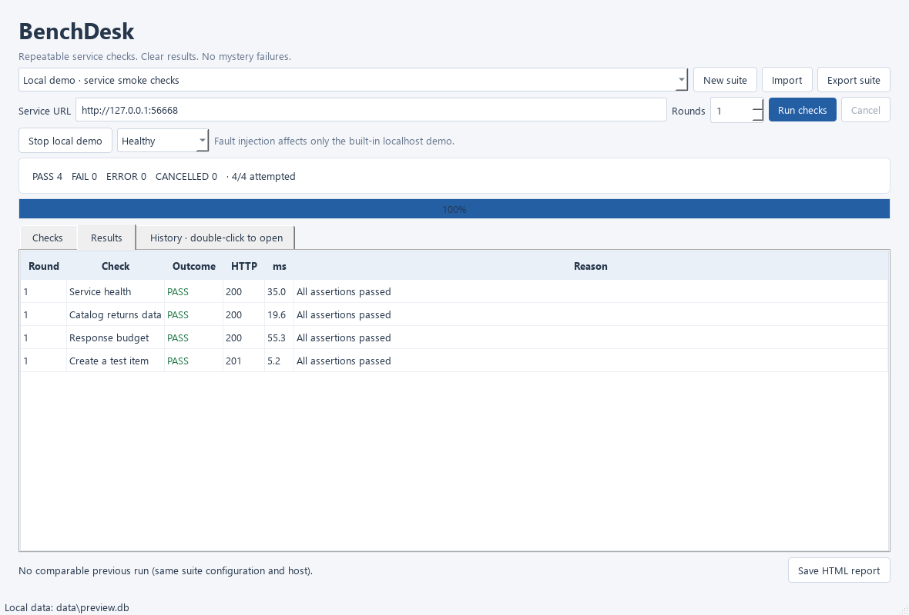

# BenchDesk

A Windows desktop workbench for repeatable HTTP service checks. Save a small test suite, run it against a service, see which assertions failed, and compare with the last matching run. There's a built-in local service with fault injection, so you can try the whole workflow without an account or external API.



This is a small developer/QA tool, not a Postman replacement or a load-testing platform. It is written in Python with PySide6, httpx, and SQLite. It doesn't use an AI service or send diagnostics to a remote server.

## Run on Windows

Python 3.11 or newer, from this folder:

```powershell
python -m venv .venv
.\.venv\Scripts\python.exe -m pip install -r requirements.lock
.\.venv\Scripts\python.exe -m benchdesk --demo
```

On the prepared development machine, double-click `Start_BenchDesk.cmd`. It launches the packaged app if a build exists, otherwise the local virtual environment. On a fresh clone, install the dependencies first. The default suite is installed automatically on first startup.

1. Click **Run checks**. The four demo checks should pass.
2. Choose **Server error**, **Bad JSON**, or **Slow responses** and run again.
3. Look at **Results** and the comparison line. The demo POST endpoint stays healthy; GET faults are independent.
4. Double-click a run in **History** to reopen it, or save a standalone HTML report.

The demo binds only to `127.0.0.1` on an available port and stops when the window closes. Stopping it does not shut down any other service on your computer. For a real target, enter its HTTP(S) origin, edit the checks, and confirm the request warning. Test only systems you own or have permission to test. POST checks can change remote state; cancellation does not undo an accepted request.

## Checks and suites

Create a suite, then add or edit checks:

- GET or POST, relative endpoint path, expected HTTP status
- Optional JSON assertion with dot-separated keys/indexes, e.g. `items.0.name`
- Expected value as JSON (`"ok"`, `true`, `12`, `null`), with strict type comparison
- Elapsed-time budget and an overall request deadline
- JSON header object, POST body, enabled/disabled toggle
- 1–10 sequential rounds, up to 30 checks per suite

Imports get a new suite ID instead of overwriting anything. Exported suites are versioned JSON files. Credentials in Authorization/Cookie/token/API-key headers must be references such as `env:BENCHDESK_TOKEN`, not literal values. Put the complete header value (including `Bearer `, if needed) in that environment variable before launching the app. BenchDesk does not load a `.env` file automatically.

Suites and history live in `%LOCALAPPDATA%\BenchDesk\benchdesk.db`. Override this with `--database data/benchdesk.db`. SQLite is not encrypted: suites may contain sensitive paths, bodies, or other literal headers. Environment references keep credential values out of saved suites, but they are not a secret vault. Real suites, databases, and reports should stay private and out of Git.

## Results

`PASS` means all configured assertions passed. `FAIL` means a status, JSON assertion, or time budget failed. `ERROR` means a timeout, network/TLS problem, missing credential variable, invalid request configuration, or oversized response. `CANCELLED` describes an interrupted check; checks not started are not fabricated as successes.

Comparisons use the same saved suite configuration and target origin; they skip cancelled previous runs. A regression is a previously passing check that no longer passes, not a statistically significant performance change. Round counts can differ; only matching check IDs/round numbers are compared.

Reports and history exclude query strings, headers, request/response bodies and raw transport exception messages. Check names, hostnames, JSON assertion paths in suites, and URL path segments can still be private. The UI displays generic JSON mismatch reasons, not the potentially sensitive actual value. Timings include client/network overhead and are unsuitable as benchmark claims.

## Headless run

```powershell
.\.venv\Scripts\python.exe -m benchdesk --headless --demo --repeat 2 --output exports/demo.html
.\.venv\Scripts\python.exe -m benchdesk --headless --suite private-suite.json --url http://127.0.0.1:8000
```

Exit codes: `0` for a nonempty all-pass run, `1` for failed checks, `2` for invalid input/output. Existing output files are never overwritten. Headless mode does not save database history and sends the configured requests without a GUI confirmation; inspect imported suites before running them.

## Local database backup

From the source installation, create a consistent backup of saved suites and history:

```powershell
.\.venv\Scripts\python.exe -m benchdesk.backup --output data/backup-2026-10-05.db
```

The default source is `%LOCALAPPDATA%\BenchDesk\benchdesk.db`; override it with
`--source data/test.db`. SQLite's backup API includes committed WAL data even while
the app is open. Existing destinations are never overwritten, missing source files
are not created, and failed copies are removed. A busy backup is aborted after about
15 seconds; retry later. Backups are unencrypted and may contain private suite data.
Keep them outside Git. This is a source CLI utility, not a new GUI button.

To inspect a backup, launch with `--database path/to/backup.db`. This opens a working
database and can modify it, so inspect a spare copy rather than your only backup.
Automatic restore and history pruning are not implemented.

## Windows build

```powershell
powershell -NoProfile -ExecutionPolicy Bypass -File scripts/build_windows.ps1
```

The script builds `dist/BenchDesk/BenchDesk.exe` with PyInstaller. Keep the whole `dist/BenchDesk` folder together; the executable depends on its `_internal` directory. The build is unsigned and isn't an installer. Executables/build files stay out of Git. Review bundled dependency licenses before distributing a release; no release or redistribution license is selected yet.

To smoke-test the packaged Qt window without manual clicks, run `dist/BenchDesk/BenchDesk.exe --smoke-test --database data/package-check.db`. It starts its own localhost demo, executes the suite, saves history, and exits. Set `QT_QPA_PLATFORM=offscreen` for a noninteractive packaging check.

## Development

```powershell
.\.venv\Scripts\python.exe -m pytest -q
.\.venv\Scripts\python.exe -m ruff check .
.\.venv\Scripts\python.exe -m ruff format --check .
.\.venv\Scripts\python.exe -m pip check
```

Tests use temporary databases, mocked HTTP transports, a real localhost demo, and Qt's offscreen platform. GitHub Actions runs the same checks on Windows. `scripts/preview.py` captures the actual local GUI with demo data; it does not generate a mockup.

Local verification: 53 source tests passed on Windows/Python 3.11 and Ruff checks passed. The earlier packaged `.exe` completed both a Qt smoke run and a headless HTTP/report run; it does not include the new standalone backup module. Testing on another Windows PC is still pending.

[Architecture](docs/ARCHITECTURE.md) · [Development notes](docs/DEVELOPMENT.md) · [Task list](TASKS.md)

## Limits

- HTTP(S) only; one origin per run, no URL credentials, origin path prefixes, redirects, proxy environment, or configurable TLS bypass.
- Decoded response content is limited to 128 KiB and request bodies to 32 KiB. Deadlines are 0.1–30 seconds. Cancellation is cooperative and normally noticed within 25 ms, plus transport cleanup; it is not a server-side rollback.
- Only the latest 100 runs per suite are shown; older records stay in SQLite. There is no retention/pruning UI yet.
- JSON path syntax is deliberately small: dot-separated keys and numeric array indexes, not full JSONPath. Keys containing dots aren't supported.
- No scheduler, parallel runs, browser automation, OAuth login, or response-body inspector. The app has no remote collection management or telemetry.
- Closing during a run cancels it, saves partial history when possible, waits for the thread, then closes the demo. A process crash can lose the current unfinished run; no recovery is claimed.
